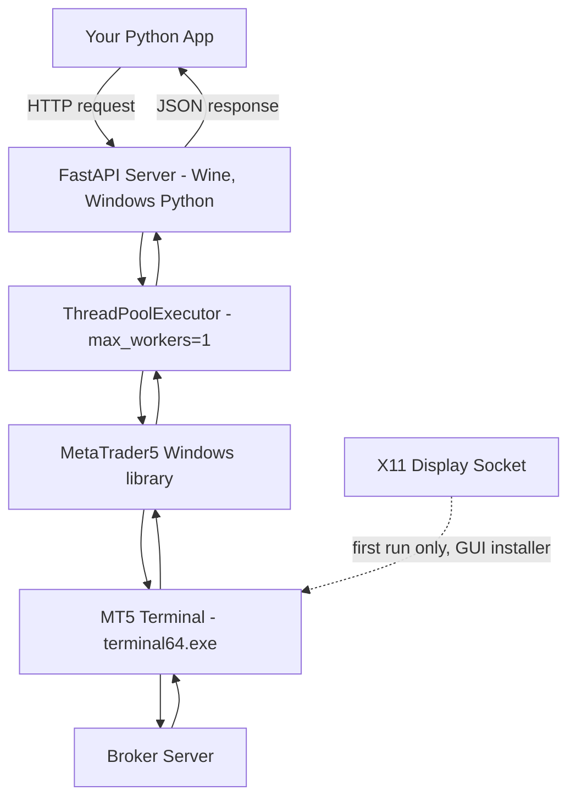

# MetaTrader 5 (MT5) Linux Bridge

An open-source, lightweight Docker-based bridge that enables the official MetaTrader 5 Python library to run seamlessly on Linux.

[](https://opensource.org/licenses/MIT)
[](https://www.docker.com/)
[](https://www.winehq.org/)

Repository: [github.com/SirDaniell/MT5Bridge_Linux](https://github.com/SirDaniell/MT5Bridge_Linux)

---

## Table of Contents

- [The Linux Issue](#the-linux-issue-why-this-exists)
- [How It Works](#how-it-works-architecture)
- [Installation](#installation)
  - [Prerequisites](#prerequisites)
  - [Option 1: Quick Start](#option-1-quick-start-recommended)
  - [Option 2: Manual Installation](#option-2-manual-installation)
  - [Option 3: Clean Install / Reset](#option-3-clean-install--reset)
- [API Endpoint Reference](#api-endpoint-reference)
- [Using the Bridge in Your Python App](#using-the-bridge-in-your-python-app)
- [Troubleshooting](#troubleshooting)
- [Advanced Configuration](#advanced-configuration)
- [Development & Testing](#development--testing)
- [Contributing](#contributing)
- [License](#license)
- [Acknowledgments](#acknowledgments)

---

## The Linux Issue (Why this exists)

The official `MetaTrader5` Python package is a Windows-only library. It relies heavily on Windows system files (DLLs) and the Windows API to communicate directly with the desktop MT5 terminal.

If you try to import it or run it on Linux, it will fail. This makes it difficult to deploy automated Python trading bots, real-time data pipelines, or web dashboards to Linux-based cloud servers (such as a VPS or Docker host).

**MT5 Linux Bridge solves this problem.** It wraps the Windows-native Python package and the MT5 desktop terminal inside a Wine-configured Docker container, exposing all MT5 functions through a fast, asynchronous FastAPI REST API.

---

## How It Works (Architecture)

```
+----------------------------------------------------------+
|                       Linux Host                          |
|  +------------------------------------------------------+ |
|  |                  Docker Container                     | |
|  |  +--------------------------------------------------+ | |
|  |  |                     Wine 10                       | | |
|  |  |  +-----------------+     +-----------------+      | | |
|  |  |  |  FastAPI Server |<--->|   MT5 Terminal  |       | | |
|  |  |  | (Windows Python)|     |  (terminal64)   |      | | |
|  |  |  +--------+--------+     +-----------------+      | | |
|  |  +----+------+----------------------------------------+ |
|  +-------+------+--------------------------------------- + |
|          |      |                                          |
|   HTTP   |      |   X11 Display Socket                     |
|  (Port)  |      +--(installer GUI, first run only)-------->| (Host Screen)
+----------+------------------------------------------------+
           v
   Your Application / SDK
```

Below is the same flow expressed as a request lifecycle, from your code down to the broker and back:



### Components

1. **Docker Container** - runs a lightweight Debian environment with Wine 10 installed.
2. **Wine Environment** - a Windows compatibility layer that lets the official, unmodified `MetaTrader5` Python package run on Linux.
3. **Embedded Windows Python 3.10** - runs inside Wine and imports the official MT5 library directly.
4. **FastAPI Server** - launched inside Wine, exposes every MT5 function as a REST endpoint.
5. **MT5 Terminal** - the official MetaTrader 5 desktop application (`terminal64.exe`), running under Wine.
6. **X11 Socket** - forwards the host display into the container so the graphical MT5 installer can appear on your screen during first-time setup only.

### Thread Safety

The MT5 terminal is not thread-safe. To prevent crashes, the FastAPI server runs all MT5 interactions through a dedicated single-threaded background worker (`ThreadPoolExecutor` with `max_workers=1`). The REST API endpoints themselves remain fully asynchronous and non-blocking, so multiple clients can call the bridge concurrently while MT5 operations are serialized safely underneath.

---

## Installation

### Prerequisites

Before you begin, make sure you have:

- A Linux operating system with an active desktop environment (Ubuntu, Debian, Fedora, etc.)
- [Docker](https://docs.docker.com/get-docker/) version 20.10 or later
- [Docker Compose](https://docs.docker.com/compose/install/) version 1.29 or later
- An X11 display server (usually pre-installed on Linux desktops)
- The `xhost` utility (for granting X11 permissions to Docker)

**Install prerequisites on Ubuntu/Debian:**
```bash
# Install Docker
curl -fsSL https://get.docker.com -o get-docker.sh
sudo sh get-docker.sh

# Install Docker Compose
sudo apt-get update
sudo apt-get install docker-compose

# Install xhost (for X11 GUI support)
sudo apt-get install x11-xserver-utils

# Add your user to the docker group (removes the need for sudo)
sudo usermod -aG docker $USER
# Log out and back in for this to take effect
```

**Install prerequisites on Fedora:**
```bash
sudo dnf install docker docker-compose xorg-x11-server-utils
sudo systemctl start docker
sudo systemctl enable docker
sudo usermod -aG docker $USER
```

**Verify your installation:**
```bash
docker --version           # Should show Docker version 20.10+
docker-compose --version   # Should show docker-compose version 1.29+
xhost                      # Should run without errors
```

---

### Option 1: Quick Start (Recommended)

Best for first-time users, quick testing, and demos. The included `quickstart.sh` script checks prerequisites, configures X11 access, builds the image, and starts the container for you.

```bash
# 1. Clone the repository
git clone https://github.com/SirDaniell/MT5Bridge_Linux.git
cd MT5Bridge_Linux

# 2. Run the quick start script
./quickstart.sh
```

**What it does:**
- Checks that Docker and Docker Compose are installed
- Runs `xhost +local:docker` to configure X11 permissions automatically
- Builds the Docker image and starts the bridge container
- Streams container logs so you can watch progress in real time

**Next steps after running it:**
1. Wait 2-3 minutes while Wine and the container initialize.
2. The **MT5 Installation Wizard** window will appear on your screen - complete the installation manually.
3. Wait for the container's health check to report as `healthy` in the logs.
4. The API is now available at `http://localhost:8217/docs`.

---

### Option 2: Manual Installation

Best for developers, custom configurations, or integrating the bridge into a larger project.

#### Step 1: Configure X11 Access

The MT5 installer needs a graphical connection to your screen for its one-time setup wizard:

```bash
xhost +local:docker
```

To make this permanent across reboots:
```bash
echo "xhost +local:docker" >> ~/.bashrc
```

If needed, confirm which display Docker should use:
```bash
echo $DISPLAY   # commonly :0, or :1 for a second display, or :10+ for SSH X11 forwarding
```

#### Step 2: Build and Start the Container

```bash
docker-compose build
docker-compose up -d
docker-compose logs -f
```

#### Step 3: Complete the MT5 Installation

1. Within a few minutes, the **MetaTrader 5 Installation Wizard** pops up on your host desktop.
2. Click **Next** through the installer prompts.
3. Wait for the installation to finish; the installer window closes automatically.
4. The container then configures and starts the FastAPI REST server on its own.

#### Step 4: Verify the Installation

```bash
# Check container status
docker-compose ps

# Check container health
docker inspect --format='{{.State.Health.Status}}' mt5-bridge
# Should print: healthy

# Test the API
curl http://localhost:8217/test
# Example response: {"time": "2026-07-05 12:34:56"}
```

#### Step 5: Initialize the Broker Connection

Once the bridge is running, connect it to your trading account:

```bash
curl -X POST http://localhost:8217/initialize \
  -H "Content-Type: application/json" \
  -d '{
    "login": 12345678,
    "password": "your_password",
    "server": "Broker-Server-Name"
  }'
```

The default host port is `8217`, mapped to container port `5000` in `docker-compose.yml`.

---

### Option 3: Clean Install / Reset

Best for troubleshooting, a corrupted Wine prefix, or starting completely fresh.

```bash
# Using the included helper script
./rebuild.sh clean

# Or manually
docker-compose down
docker volume rm mt5bridge_linux_wine_prefix
docker-compose up --build -d
```

This removes the Wine environment and the MT5 installation, so you will need to complete the installer again on the next start.

The `rebuild.sh` script also supports two other modes:
```bash
./rebuild.sh              # Normal rebuild, uses Docker layer cache
./rebuild.sh --no-cache   # Full rebuild, no cache, keeps existing Wine prefix
```

---

## API Endpoint Reference

The API is fully documented with interactive Swagger docs available at `http://localhost:8217/docs` when the bridge is running.

**Base URL:** `http://localhost:8217`

### 1. Connection & Lifecycle

| Endpoint | Method | Description |
|---|---|---|
| `/install` | POST | Starts downloading and launching the MT5 setup wizard (only needed if the automatic first-boot wizard fails) |
| `/initialize` | POST | Connects the bridge to your broker using account credentials |
| `/shutdown` | POST | Disconnects from the broker and safely closes the MT5 terminal |

**Example:**
```bash
curl -X POST http://localhost:8217/initialize \
  -H "Content-Type: application/json" \
  -d '{
    "login": 12345678,
    "password": "your_password",
    "server": "Broker-Server-Name"
  }'
```

### 2. Status & Account Information

| Endpoint | Method | Description |
|---|---|---|
| `/test` | GET | Health check; returns the server's local time |
| `/status` | GET | Whether the MT5 terminal is open and connected to the broker |
| `/get_account_info` | GET | Fetches balance, equity, leverage, margin, and account name |

**Example:**
```bash
curl http://localhost:8217/get_account_info
```

### 3. Symbol Management

| Endpoint | Method | Description |
|---|---|---|
| `/symbols` | GET | Lists the names of all active symbols in the Market Watch |
| `/symbols/total` | GET | Returns the total count of symbols available on the broker's server |
| `/symbol/info` | POST | Retrieves detailed specifications for a symbol (pip size, contract size, margin currency, etc.) |
| `/symbol/tick` | POST | Fetches the latest bid/ask tick for a specific symbol |
| `/symbol/select` | POST | Enables or disables a symbol in the Market Watch |

### 4. Historical Market Data

Query historical bars (OHLCV) and ticks. Naive UTC timestamps are used throughout for consistency.

| Endpoint | Method | Description |
|---|---|---|
| `/rates/from` | POST | Fetches a set number of bars starting from a specific date or position index |
| `/rates/range` | POST | Fetches all bars between a start date and an end date |
| `/ticks/from` | POST | Fetches high-precision tick history starting from a given timestamp |
| `/ticks/range` | POST | Fetches tick history between two timestamps |

**Example:**
```bash
curl -X POST http://localhost:8217/rates/from \
  -H "Content-Type: application/json" \
  -d '{
    "symbol": "EURUSD",
    "timeframe": "H1",
    "count": 100
  }'
```

### 5. Live Trading Operations

| Endpoint | Method | Description |
|---|---|---|
| `/trade/open` | POST | Opens a new market execution trade (BUY or SELL) with optional Stop Loss (SL) and Take Profit (TP) |
| `/trade/close` | POST | Closes an open position by its ticket ID |
| `/trade/close_all` | POST | Closes all active open positions (can be filtered by symbol) |
| `/trade/pending` | POST | Places a pending order (`BUY_LIMIT`, `SELL_LIMIT`, `BUY_STOP`, `SELL_STOP`, `BUY_STOP_LIMIT`, `SELL_STOP_LIMIT`) |
| `/trade/modify_position` | POST | Modifies the SL and TP values of an active position |
| `/trade/modify_order` | POST | Modifies the execution price, SL, TP, or expiration of an existing pending order |
| `/trade/cancel_order` | POST | Cancels or deletes an active pending order |

**Example:**
```bash
curl -X POST http://localhost:8217/trade/open \
  -H "Content-Type: application/json" \
  -d '{
    "symbol": "EURUSD",
    "order_type": "BUY",
    "volume": 0.1,
    "sl": 1.0800,
    "tp": 1.0900
  }'
```

### 6. Trading History

| Endpoint | Method | Description |
|---|---|---|
| `/history/deals` | POST | Gets completed trades/transactions within a date range |
| `/history/deals/total` | POST | Counts completed transactions within a date range |
| `/history/orders` | POST | Retrieves filled or canceled order history within a date range |
| `/history/orders/total` | POST | Counts order history within a date range |

### 7. Economic Calendar

Interact with MT5's built-in economic calendar files.

| Endpoint | Method | Description |
|---|---|---|
| `/calendar/health` | GET | Verifies the status of the local MQL5 calendar files |
| `/calendar/countries` | GET | Lists all countries tracked in the economic calendar |
| `/calendar/events` | GET | Retrieves the global economic event list, filterable by importance, country, or sector |
| `/calendar/values/recent` | GET | Fetches recent economic values and releases |
| `/calendar/values/upcoming` | GET | Fetches upcoming scheduled economic indicators |
| `/calendar/search` | GET | Searches calendar events by keyword |

---

## Using the Bridge in Your Python App

The bridge works like a drop-in replacement for the official `MetaTrader5` Python library. Instead of calling `mt5.copy_rates_from(...)` directly, your code calls the bridge's HTTP endpoint and gets the same data back.

Here is how the layers connect:

```
Your Code
    |  calls  mt5_service.fetch_ohlcv_v2("EURUSD", "H1", 100)
    v
MT5Service (mt5_service.py)
    |  sends  POST http://localhost:8217/rates/from
    v
MT5 Bridge (Docker container)
    |  runs   mt5.copy_rates_from("EURUSD", H1, 100)   <- real Windows MT5 library
    v
MT5 Terminal (Wine)
    |  queries your broker's server
    v
Returns candle data all the way back up
```

### Option A: Call the REST API directly with `httpx`

```python
import asyncio
import httpx

async def main():
    base_url = "http://localhost:8217"

    # 1. Initialize MT5
    async with httpx.AsyncClient() as client:
        response = await client.post(
            f"{base_url}/initialize",
            json={
                "login": 12345678,
                "password": "your_password",
                "server": "YourBroker-Server"
            }
        )
        print(response.json())

    # 2. Fetch candle data
    async with httpx.AsyncClient() as client:
        response = await client.post(
            f"{base_url}/rates/from",
            json={
                "symbol": "EURUSD",
                "timeframe": "H1",
                "count": 100
            }
        )
        candles = response.json()
        print(f"Fetched {len(candles)} candles")

    # 3. Get account info
    async with httpx.AsyncClient() as client:
        response = await client.get(f"{base_url}/get_account_info")
        account = response.json()
        print(f"Balance: ${account['balance']}")

asyncio.run(main())
```

### Option B: Use the Included Service Client (recommended)

A ready-made service client, `mt5_service.py`, is included in the repository. Drop it into your project and you are good to go.

**Install the dependency first:**
```bash
pip install httpx
```

**Then use it like this:**
```python
import asyncio
from mt5_service import MT5Service

async def main():
    # Point the service to wherever your bridge is running.
    # Default is localhost:8217 (the port mapped in docker-compose.yml)
    mt5 = MT5Service(host="localhost", port=8217)

    # --- Step 1: Connect to your broker ---
    result = await mt5.initialize_mt5(
        login=12345678,
        password="your_password",
        server="YourBroker-Demo"
    )
    print(result)  # {"success": true, ...}

    # --- Step 2: Fetch candle (bar) data ---
    # Equivalent to mt5.copy_rates_from("EURUSD", mt5.TIMEFRAME_H1, 100)
    # in the native Windows library
    data = await mt5.fetch_ohlcv_v2("EURUSD", timeframe="H1", count=100)
    print(data)
    # Returns a list of bars, each bar is:
    # [time, open, high, low, close, tick_volume, spread, real_volume]

    # --- Step 3: Get account info ---
    account = await mt5.get_account_info()
    print(account)  # {"balance": 10000.0, "equity": ..., "leverage": 100, ...}

    # --- Step 4: Get the latest live tick ---
    ticks = await mt5.get_ticks("EURUSD", count=5)
    print(ticks)
    # Each tick is: [time, bid, ask, last, volume, time_msc, flags, volume_real]

asyncio.run(main())
```

### Common Operations at a Glance

| What you want to do | Function to call |
|---|---|
| Connect to broker | `mt5.initialize_mt5(login, password, server)` |
| Get account balance | `mt5.get_account_info()` |
| Get candle history | `mt5.fetch_ohlcv_v2(symbol, timeframe, count)` |
| Get latest ticks | `mt5.get_ticks(symbol, count)` |
| Get all symbols | `mt5.get_available_symbols()` |
| Get symbol details | `mt5.get_symbol_info(symbol)` |
| Disconnect cleanly | `mt5.shutdown_mt5()` |

### Environment Variables

If your bridge is running on a remote server or inside Docker on the same machine, you can configure the host using environment variables instead of hardcoding them:

```bash
export MT5_HOST=localhost
export MT5_PORT=8217
```

`MT5Service` reads these automatically, so you do not need to pass `host` and `port` arguments at all:

```python
mt5 = MT5Service()  # Reads MT5_HOST and MT5_PORT from environment
```

---

## Troubleshooting

### No MT5 Installer Window Appears / "Cannot Open Display"

**Symptoms:** the container starts but no GUI window shows, or logs display `Cannot connect to X server`.

**Solutions:**
```bash
# Allow Docker containers to access your X server
xhost +local:docker

# Confirm your DISPLAY variable matches your active session
echo $DISPLAY   # usually :0

# In docker-compose.yml, make sure:
#   environment:
#     - DISPLAY=${DISPLAY:-:0}

# Then restart
docker-compose restart
```

### IPC Timeout Error on `/initialize`

**Symptom:** the initialize endpoint returns an error indicating MT5 cannot connect or times out.

**Solution:** MT5 is likely running but blocked by a popup window (an update prompt or login modal). Open your host screen, check whether the MT5 GUI window has an open dialog box, and close or complete it.

### Wine Test Fails / `kernel32.dll` Error

**Symptom:**
```
Wine is broken or the prefix is corrupted
wine: could not load kernel32.dll
```

**Solution:** perform a clean rebuild, which removes and recreates the Wine prefix:
```bash
./rebuild.sh clean

# Or manually
docker-compose down
docker volume rm mt5bridge_linux_wine_prefix
docker-compose up --build -d
```

### Container Keeps Restarting

Check the logs first:
```bash
docker-compose logs -f
```

Common causes:
1. Wine initialization timeout - the first run can take 5-6 minutes; be patient.
2. Missing X11 permissions - run `xhost +local:docker`.
3. `DISPLAY` variable not set - `export DISPLAY=:0`.

### API Returns 503 Service Unavailable

**Symptom:**
```bash
curl http://localhost:8217/test
# Connection refused or 503 error
```

**Solutions:**
```bash
# Wait for initialization to finish, watch for a "ready" message in the logs
docker-compose logs -f

# Check container health (should report healthy after 3-6 minutes)
docker inspect --format='{{.State.Health.Status}}' mt5-bridge

# Confirm MT5 was actually installed
docker exec mt5-bridge ls "/home/wineuser/.wine/drive_c/Program Files/MetaTrader 5/terminal64.exe"
```

### Permission Denied Errors

**Symptom:**
```
Error response from daemon: permission denied
```

**Solution:**
```bash
sudo usermod -aG docker $USER
# Log out and back in, then verify:
docker ps
```

### Wiping and Resetting a Corrupted Wine Prefix

Stop the container, remove the Docker volume storing the Wine prefix, and start again. It will automatically recreate a fresh prefix and re-download the MT5 installer.
```bash
docker-compose down
docker volume rm wine_prefix
docker-compose up -d
```

---

## Advanced Configuration

### Custom Port

Change the host-side port mapping in `docker-compose.yml`:
```yaml
ports:
  - "9999:5000"   # Use port 9999 on the host instead of 8217
```

### Environment Variables

Create a `.env` file in the project root:
```bash
# Display configuration
DISPLAY=:0

# Wine configuration
WINESERVER_TIMEOUT=300
WINEARCH=win64

# API configuration
FLASK_PORT=5000
```

### Resource Limits

Adjust container resource allocation in `docker-compose.yml`:
```yaml
deploy:
  resources:
    limits:
      cpus: '4'
      memory: 8G
    reservations:
      cpus: '2'
      memory: 4G
```

### Persistent MT5 Data

Mount the MT5 data directory so it survives container recreation:
```yaml
volumes:
  - wine_prefix:/home/wineuser/.wine
  - mt5_data:/home/wineuser/.wine/drive_c/Program Files/MetaTrader 5
```

---

## Development & Testing

**View logs:**
```bash
docker-compose logs -f
docker-compose logs -f --tail=100   # Last 100 lines
```

**Execute commands inside the container:**
```bash
docker exec -it mt5-bridge bash
wine --version
python3 --version
```

**Test that Wine is working:**
```bash
docker exec mt5-bridge wine cmd /c ver
```

**Rebuild after code changes:**
```bash
./rebuild.sh              # Fast rebuild with cache
./rebuild.sh --no-cache   # Full rebuild, no cache
```

---

## Contributing

Contributions are welcome. Please:

1. Fork the repository
2. Create a feature branch
3. Make your changes
4. Test thoroughly
5. Submit a pull request

---

## License

This project is licensed under the MIT License - feel free to use, modify, and distribute it in your own projects.

---

## Acknowledgments

- [Wine Project](https://www.winehq.org/) - Windows compatibility layer
- [MetaQuotes](https://www.metaquotes.net/) - MetaTrader 5 platform
- [FastAPI](https://fastapi.tiangolo.com/) - Modern Python web framework